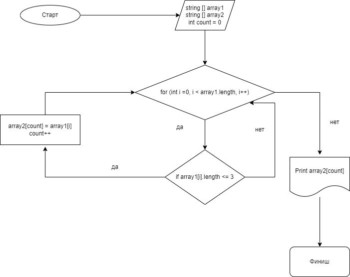

# Итоговая котрольная работа 
Задания:
1. Создать репозиторий на GitHub
2. Нарисовать блок схему алгоритма программы
3. Подготовить и раместить файл README.md в репозитории
4. Написать программу, которая из имеющегося массива строк формирует массив из строк, длина которых меньше, либо равна 3 символа. Первоначальный массив можно ввести с клавиатуры, либо задать на старте выполнения алгоритма.
5. Выполнить работу с использованием системы контроля версий

Задание № 1, 5 
https://github.com/BoginskiyVV/FinalWorkFirstQuarter.git

Задание № 2, 3, 4
Алгоритм программы выполнения задачи

# Описание решения задачи
Для решения задачи необходимо создать два массива, и переменную count.

С целью получения заданных параметров массива необходимо создать метод, который с помощью цикла _for_ проведёт проверку всей длины массива, на предмет соответствия условия <=3.

В случае совпадения результата в соответствии с условием, программа вносит полученные данные в переменную count второго массива.
В случае отстутвия совпадений программа выходит переменную со значением 0.

Для вывода полученных значений также будет использовать метод "вывода в консоль полученных данных"
